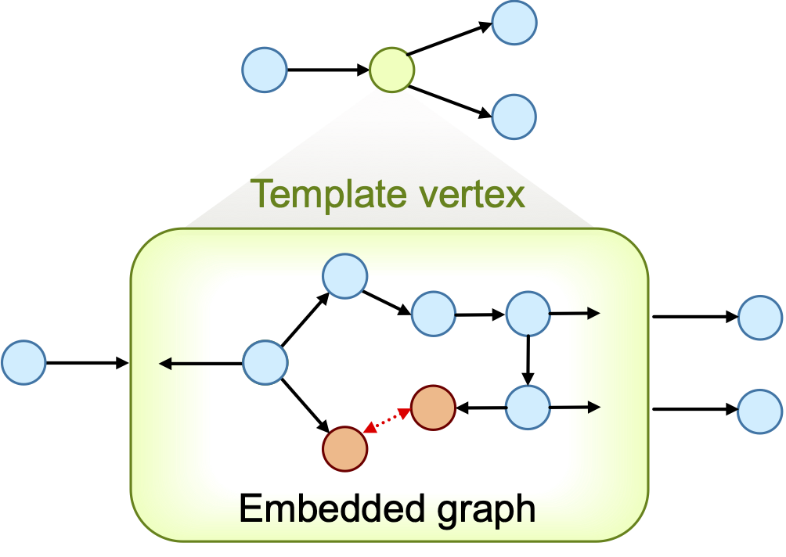

# Exercise 3.0: Evolutionary Design of &kappa;<sup>3</sup>-Chelator for Pt(CO)

## Introduction
Multidentate ligands play a critical role in transition-metal chemistry. Therefore, this exercise is dedicated to the design of rings that involve a metal center and a tuneable organic ligand.

Like in the [previous exercise](../exercise_2.0/README.md) we set as chemical goal the elongation of the CO bond on Pt(II) complexes. This time, however, we explore  tridentate ligands that adhere to the previous [X, L, X] pattern, namely, so that the L site is *trans* to the carbonyl ligand and the two X sites are both *cis* to CO and trans to each other.

To define such constrain, while allowing DENOPTIM to change the components forming the ring, we make use of **Template** vertexes. Templates are special vertexes that can embed graph and can define constraints on such embedded graphs. Also, while the embedded graph may be editable, the Template appears as a single vertex, when seen from the outside.



**Figure 1**: A template vertex contains an embedded graph (bottom), but is seen as a single vertex in the graph that owns the template vertex (top).

The design of rings poses an additional challenge: the closability of a chain cannot be given for granted unless the chain elements are constrained to include only known rings. Even then, substituents on the chain may prevent the actual formation of the ring by adding steric hindrance, or by adding additional constraints (e.g., fused rings). Since in de novo design we typically want to explore unknown structural features, we want i) to avoid assumptions on the closability and ii) to assess closability on the fly. In this example, we use hybrid approach in that only rings with a certain size (i.e., atom count) are allowed to form, but their closability is evaluated only in the molecular modeling workflow by a dedicated ring-closing conformational search (further details at [*J. Chem. Inf. Model.* **2015**, 55, 9, 1844–1856](https://doi.org/10.1021/acs.jcim.5b00424)).

Again, to save time, we will use a list of pre-computed molecules that has been processed via the ring-closing and geometry optimization workflow as to compute the fitness value (i.e., the length of the C&equiv;O bond).


## Instructions
1. Start DENOPTIM from within the `exercise_3.0` folder. This is done from the Terminal (macOS/Linux) or the Anaconda prompt (Windows):
```
cd your_path_to_exercise_3.0
denoptim
```

2. build Template


**Figure 2**: Detail of the template to build with the graphical interface.


symmetry

run

> **Question**: plot the number of attempts to build new candidates. How does it compare with the design of ligand sets made only of monodentate ligands?  


## Discussion
-
